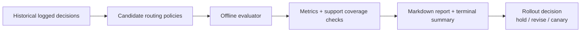

# agent-routing-eval-lab

**Offline evaluation lab for agent routing and tool-selection policies before production.**

Most agent teams tweak prompts, routers, tool catalogs, and policy rules frequently. This lab demonstrates why production changes need offline evaluation first: a new policy can improve one metric while quietly increasing cost, latency, unsafe actions, or unresolved requests.

## What this repo demonstrates

- Replaying logged decisions from a realistic support/ops scenario
- Comparing candidate routers on the same historical data
- Measuring quality/cost/latency/safety trade-offs
- Flagging weak support/coverage regions in logs
- Using context-aware bounded tool cards vs exposing every tool schema
- Generating a decision-ready report before rollout

## Architecture



See `/docs/architecture.md` for details.

## Documentation

- [Architecture](docs/architecture.md) — System design and data flow
- [Evaluation Methodology](docs/evaluation_methodology.md) — How metrics are calculated
- [Consultant Playbook](docs/consultant_playbook.md) — Guidance for enterprise adoption
- [Glossary](docs/glossary.md) — Definitions of key terms

## Quickstart

```bash
make install
make test
make generate-data
make evaluate
make report
make demo
```

## Example comparison output

| Policy | Success | Correct Tool | Avg Cost | Avg Latency (ms) | Unsafe | Unresolved | Regret | Score |
|---|---:|---:|---:|---:|---:|---:|---:|---:|
| contextweaver_v1 | 79.67% | 83.67% | $0.153 | 183.3 | 2.67% | 8.67% | 0.319 | 83.41 |
| baseline | 62.00% | 66.00% | $0.309 | 304.2 | 3.00% | 37.67% | 0.666 | 66.67 |
| strict_policy | 46.00% | 46.00% | $0.065 | 121.8 | 0.00% | 44.67% | 0.711 | 60.91 |
| cost_aware | 23.67% | 23.67% | $0.051 | 105.4 | 0.00% | 23.00% | 1.014 | 49.38 |

Source: mirrors `reports/example_report.md`, generated by `make demo` with 300 synthetic rows and seed 7.

## Enterprise governance mapping

Use this lab as a pre-deployment gate before online A/B testing. It helps teams reject policy changes that improve happy-path demos but harm safety, support coverage, or operating cost.

## Public library showcase

- **`skdr-eval`**: wrapped by `src/agent_routing_eval_lab/adapters/skdr_eval_adapter.py` as the evaluation anchor. The adapter is explicit about fallback behavior and emits warnings when native API wiring is unavailable.
- **`contextweaver`**: demonstrated via bounded tool cards in `src/agent_routing_eval_lab/adapters/contextweaver_adapter.py` and the `ContextWeaverRouter`.

Optional extensions to deterministic flows (e.g., ChainWeaver) or governance layers (e.g., AgentFence / agent-kernel) are noted in docs, but routing evaluation stays the main focus.

## When to use this pattern

- Evaluating agent router changes safely
- Reducing tool-call costs without quality regressions
- Validating stricter safety/approval policies
- Preparing an agent for production rollout
- Comparing prompt/model/tool-catalog changes before traffic exposure

## Limitations

- Synthetic demo data, not production telemetry
- Offline evaluation cannot replace online experiments
- Still requires red-teaming and human review for high-risk actions
- Counterfactual estimates are sensitive to support/coverage in logs

See [`docs/non-goals.md`](docs/non-goals.md) for scope boundaries that keep the
lab focused on offline routing evaluation rather than live runtime ownership.
