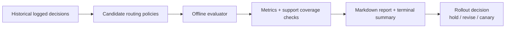

# agent-routing-eval-lab

**Offline evaluation lab for agent routing and tool-selection policies before production.**

Most agent teams tweak prompts, routers, tool catalogs, and policy rules frequently. This lab demonstrates why production changes need offline evaluation first: a new policy can improve one metric while quietly increasing cost, latency, unsafe actions, or unresolved requests.

## What this repo demonstrates

- Replaying logged decisions from a realistic support/ops scenario
- Comparing candidate routers on the same historical data
- Measuring quality/cost/latency/safety trade-offs
- Flagging weak support/coverage regions in logs
- Using context-aware bounded tool cards vs exposing every tool schema
- Generating a decision-ready report before rollout

## Architecture



See `/docs/architecture.md` for details.

## Documentation

- [Architecture](docs/architecture.md) — System design and data flow
- [Evaluation Methodology](docs/evaluation_methodology.md) — How metrics are calculated
- [Consultant Playbook](docs/consultant_playbook.md) — Guidance for enterprise adoption
- [Glossary](docs/glossary.md) — Definitions of key terms
- [灵台未央集成指南](docs/ling_integration.md) — 灵的三轴分析路由系统集成

## Quickstart

```bash
make install
make test
make generate-data
make evaluate
make report
make demo
```

## Example comparison output

| policy | success | correct tool | avg cost | avg latency ms | unsafe | unresolved | score |
|---|---:|---:|---:|---:|---:|---:|---:|
| contextweaver_v1 | 0.67 | 0.72 | 0.06 | 95 | 0.02 | 0.26 | 74.3 |
| strict_policy | 0.64 | 0.70 | 0.07 | 105 | 0.01 | 0.29 | 71.4 |
| cost_aware | 0.57 | 0.61 | 0.04 | 87 | 0.04 | 0.34 | 66.8 |
| baseline | 0.55 | 0.58 | 0.09 | 134 | 0.09 | 0.36 | 60.1 |

## Enterprise governance mapping

Use this lab as a pre-deployment gate before online A/B testing. It helps teams reject policy changes that improve happy-path demos but harm safety, support coverage, or operating cost.

## Public library showcase

- **`skdr-eval`**: wrapped by `src/agent_routing_eval_lab/adapters/skdr_eval_adapter.py` as the evaluation anchor. The adapter is explicit about fallback behavior and emits warnings when native API wiring is unavailable.
- **`contextweaver`**: demonstrated via bounded tool cards in `src/agent_routing_eval_lab/adapters/contextweaver_adapter.py` and the `ContextWeaverRouter`.
- **`ling-triage`**: 灵台未央三轴分析路由器，集成在 `src/agent_routing_eval_lab/routing/ling_triage_router.py` 和 `src/agent_routing_eval_lab/adapters/ling_eval_adapter.py`。支持哲学、心理学、综合、编码四轴路由分析。详见 [灵台未央集成指南](docs/ling_integration.md)。

Optional extensions to deterministic flows (e.g., ChainWeaver) or governance layers (e.g., AgentFence / agent-kernel) are noted in docs, but routing evaluation stays the main focus.

## When to use this pattern

- Evaluating agent router changes safely
- Reducing tool-call costs without quality regressions
- Validating stricter safety/approval policies
- Preparing an agent for production rollout
- Comparing prompt/model/tool-catalog changes before traffic exposure

## Limitations

- Synthetic demo data, not production telemetry
- Offline evaluation cannot replace online experiments
- Still requires red-teaming and human review for high-risk actions
- Counterfactual estimates are sensitive to support/coverage in logs
