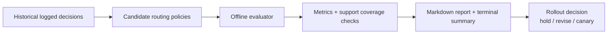

# agent-routing-eval-lab

**Offline evaluation lab for agent routing and tool-selection policies before production.**

[](https://github.com/dgenio/agent-routing-eval-lab/actions/workflows/tests.yml)
[](https://www.python.org/)
[](LICENSE)
[](https://pub.towardsai.net/the-weaver-stack-one-contract-layer-for-safe-llm-agents-7f733cad5eac)

Most agent teams tweak prompts, routers, tool catalogs, and policy rules frequently. This lab demonstrates why production changes need offline evaluation first: a new policy can improve one metric while quietly increasing cost, latency, unsafe actions, or unresolved requests.

It is a runnable reference for **off-policy / counterfactual evaluation** of **LLM-agent** **tool-calling** and **routing** policies — honest IPS/SNIPS estimates on **logged decisions**, safety/coverage gating, and a **hold / revise / canary** rollout recommendation — aimed at **AI governance**, **agent evaluation**, and **ML-platform** work.

## What this repo demonstrates

- Replaying logged decisions from a realistic support/ops scenario
- Comparing candidate routers on the same historical data
- Measuring quality/cost/latency/safety trade-offs
- Flagging weak support/coverage regions in logs
- Using context-aware bounded tool cards vs exposing every tool schema
- Generating a decision-ready report before rollout

## Architecture


```mermaid
flowchart LR
    A[Historical logged decisions] --> B[Candidate routing policies]
    B --> C[Offline evaluator]
    C --> D[Metrics + support coverage checks]
    D --> E[Markdown report + terminal summary]
    E --> F[Rollout decision \n hold / revise / canary]
```

See `/docs/architecture.md` for details.

## Documentation

- [CLI Reference](docs/cli.md) — Every subcommand, flag, and exit code
- [Unsafe Baseline → Governed Path](docs/governed_path.md) — The runnable before/after safety story
- [Input Schema](docs/input-schema.md) — Logged-decisions CSV contract (+ `validate`)
- [JSON Results Schema](docs/json-schema.md) — Machine-readable output for CI
- [Architecture](docs/architecture.md) — System design and data flow
- [Evaluation Methodology](docs/evaluation_methodology.md) — How metrics are calculated
- [Consultant Playbook](docs/consultant_playbook.md) — Guidance for enterprise adoption
- [Glossary](docs/glossary.md) — Definitions of key terms
- [Roadmap](ROADMAP.md) — Backlog themes, sequencing, and contributor entry points

## Quickstart

```bash
make install
make test
make generate-data
make evaluate
make report
make demo
```

## Example comparison output

| Policy | Success | Correct Tool | Approval Req | Avg Cost | Avg Latency (ms) | Unsafe | Unresolved | Regret | Score |
|---|---:|---:|---:|---:|---:|---:|---:|---:|---:|
| contextweaver_v1 | 71.00% | 71.00% | 25.33% | $0.162 | 193.7 | 0.33% | 19.67% | 0.408 | 76.42 |
| contextweaver_v2 | 71.00% | 71.00% | 25.33% | $0.162 | 193.7 | 0.33% | 19.67% | 0.408 | 76.42 |
| baseline | 65.33% | 69.33% | 46.00% | $0.313 | 306.5 | 4.33% | 34.00% | 0.620 | 68.77 |
| strict_policy | 44.33% | 44.33% | 11.33% | $0.081 | 132.7 | 0.00% | 45.00% | 0.729 | 59.57 |
| cost_aware | 22.67% | 22.67% | 11.33% | $0.069 | 118.3 | 0.00% | 21.67% | 1.024 | 49.21 |

Source: mirrors `reports/example_report.md`, generated by `make demo` with 300 synthetic rows and seed 7.
Every policy lands on `hold` here — the synthetic logs have thin per-`(intent, tool)`
support, so the report refuses to wave any candidate through to canary. That honest
refusal is the point; the full report shows the rollout verdicts, confidence
intervals, off-policy estimates, and support diagnostics behind it.

`make demo` prints the score chart and the coverage/adapter warnings to the terminal:

```text
Policy score chart
- contextweaver_v1 ██████████████████████████████████████ 76.42
- contextweaver_v2 ██████████████████████████████████████ 76.42
- baseline         ██████████████████████████████████ 68.77
- strict_policy    █████████████████████████████ 59.57
- cost_aware       ████████████████████████ 49.21
Winning policy: contextweaver_v1
Data:   examples/logged_decisions.sample.csv
Report: reports/example_report.md
warning: 29.0% of decisions have low support (<5 historical matches).
warning: skdr-eval not installed; reporting the local IPS/SNIPS off-policy estimate. …
```

## Unsafe baseline → governed path

See the risk, then see it contained. Two runnable agents process the same fixed
synthetic requests offline:

```bash
make unsafe-demo     # ungoverned agent: full catalog, prompt-only safety — watch it break
make governed-demo   # bounded choices + context firewall + approval-aware guard, with before/after
```

`unsafe-demo` demonstrates the failures this lab warns about (over-powered tool
selection, sending instead of drafting, following an instruction embedded in a tool
result, unapproved sensitive writes). `governed-demo` runs the same requests through
the governed path, prints a before/after comparison, and writes
`reports/governed_comparison.md`. It also shows the honest trade-off: the governed
path holds sensitive actions for human approval instead of auto-completing them.

Full walkthrough, action-guard verdicts, and the auditable log schema are in
[docs/governed_path.md](docs/governed_path.md).

## Use as a CI gate

The `gate` subcommand turns the evaluation into an executable pre-deployment
check that exits non-zero when thresholds are violated:

```yaml
- name: Routing gate
  run: agent-routing-eval-lab gate --input logs.csv --max-unsafe-rate 0.05 --min-success-rate 0.6
```

Exit codes: `0` pass, `1` gate/validation failure, `2` usage/data error. See the
[CLI reference](docs/cli.md) for `evaluate --format json`, `compare`, `validate`,
and `--dump-decisions`.

## Enterprise governance mapping

Use this lab as a pre-deployment gate before online A/B testing. It helps teams reject policy changes that improve happy-path demos but harm safety, support coverage, or operating cost.

## Public library showcase

- **`skdr-eval`**: wrapped by `src/agent_routing_eval_lab/adapters/skdr_eval_adapter.py` as the evaluation anchor. The adapter is explicit about fallback behavior and emits warnings when native API wiring is unavailable.
- **`contextweaver`**: demonstrated via bounded tool cards in `src/agent_routing_eval_lab/adapters/contextweaver_adapter.py` and the `ContextWeaverRouter`.

Optional extensions to deterministic flows (e.g., ChainWeaver) or governance layers (e.g., AgentFence / agent-kernel) are noted in docs, but routing evaluation stays the main focus.

## When to use this pattern

- Evaluating agent router changes safely
- Reducing tool-call costs without quality regressions
- Validating stricter safety/approval policies
- Preparing an agent for production rollout
- Comparing prompt/model/tool-catalog changes before traffic exposure

## Limitations

- Synthetic demo data, not production telemetry
- Offline evaluation cannot replace online experiments
- Still requires red-teaming and human review for high-risk actions
- Counterfactual estimates are sensitive to support/coverage in logs

See [`docs/non-goals.md`](docs/non-goals.md) for scope boundaries that keep the
lab focused on offline routing evaluation rather than live runtime ownership.

## Further reading

These primary sources provide background for the patterns used or discussed in the
lab. Inclusion does not imply that this repository implements or validates every
method or framework below, and results from its synthetic offline data do not
establish production safety or governance.

- [ReAct: Synergizing Reasoning and Acting in Language Models](https://arxiv.org/abs/2210.03629)
  — the reasoning-and-action pattern behind many tool-using agents.
- [Model Context Protocol specification](https://modelcontextprotocol.io/specification/2025-06-18)
  — the protocol contract for exposing tools, resources, and prompts to agents.
- [Doubly Robust Off-policy Value Evaluation for Reinforcement Learning](https://proceedings.mlr.press/v48/jiang16.html)
  — a foundational reference for doubly robust off-policy evaluation.
- [Effective context engineering for AI agents](https://www.anthropic.com/engineering/effective-context-engineering-for-ai-agents)
  — practical guidance on selecting and maintaining useful agent context.
- [NIST AI Risk Management Framework 1.0](https://www.nist.gov/publications/artificial-intelligence-risk-management-framework-ai-rmf-10)
  — a voluntary framework for incorporating trustworthiness into AI risk management.

## Keywords

Agent evaluation · offline evaluation · off-policy evaluation · counterfactual
evaluation · IPS / SNIPS · LLM agents · tool calling · agent routing · AI
governance · MLOps · Python.

Suggested GitHub topics: `agent-evaluation`, `offline-evaluation`,
`off-policy-evaluation`, `counterfactual-evaluation`, `llm-agents`,
`tool-calling`, `routing`, `ai-governance`, `mlops`, `python`.
