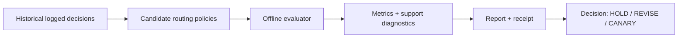

# agent-routing-eval-lab

**Offline evaluation lab for agent routing and tool-selection policies before production.**

[](https://github.com/dgenio/agent-routing-eval-lab/actions/workflows/tests.yml)
[](https://www.python.org/)
[](LICENSE)

> **Portfolio role: MEASURE IT.** This repo answers a narrow question: before changing a routing policy in production, does the logged evidence actually support the candidate—and is the right decision HOLD, REVISE or CANARY? See [scope and evidence](docs/scope-and-evidence.md).

Most agent teams tweak prompts, routers, tool catalogs, and policy rules frequently. A candidate can look better on a headline metric while quietly increasing unsafe actions, unresolved requests, cost, latency, or dependence on regions where the logs provide little support.

This lab is a runnable reference for **off-policy / counterfactual evaluation of tool-calling and routing policies on logged decisions**. Its core OSS scope is deliberately limited to **`contextweaver` + `skdr-eval`**.

It is **not** a general benchmark zoo, an LLM-router playground, or a reason to wire the whole Weaver ecosystem into one demo.

## What this repo demonstrates

- Replaying logged decisions from a synthetic support/ops scenario.
- Comparing candidate routers on the same historical evidence.
- Measuring quality, cost, latency, safety, unresolved-rate and regret trade-offs.
- Detecting weak support/coverage instead of hiding it behind a point estimate.
- Using bounded tool choices rather than exposing every schema.
- Producing a decision-ready report before rollout.
- Preserving scientifically useful **HOLD** outcomes when the evidence is weak.

## Architecture


```mermaid
flowchart LR
    A[Historical logged decisions] --> B[Candidate routing policies]
    B --> C[Offline evaluator]
    C --> D[Metrics + support diagnostics]
    D --> E[Report + receipt]
    E --> F[Decision: HOLD / REVISE / CANARY]
```

See [docs/architecture.md](docs/architecture.md) for details.

## Quickstart

```bash
make install
make test
make generate-data
make evaluate
make report
make demo
```

## Example comparison output

| Policy | Success | Correct Tool | Approval Req | Avg Cost | Avg Latency (ms) | Unsafe | Unresolved | Regret | Score |
|---|---:|---:|---:|---:|---:|---:|---:|---:|---:|
| contextweaver_v1 | 71.00% | 71.00% | 25.33% | $0.162 | 193.7 | 0.33% | 19.67% | 0.408 | 76.42 |
| contextweaver_v2 | 71.00% | 71.00% | 25.33% | $0.162 | 193.7 | 0.33% | 19.67% | 0.408 | 76.42 |
| baseline | 65.33% | 69.33% | 46.00% | $0.313 | 306.5 | 4.33% | 34.00% | 0.620 | 68.77 |
| strict_policy | 44.33% | 44.33% | 11.33% | $0.081 | 132.7 | 0.00% | 45.00% | 0.729 | 59.57 |
| cost_aware | 22.67% | 22.67% | 11.33% | $0.069 | 118.3 | 0.00% | 21.67% | 1.024 | 49.21 |

Source: mirrors `reports/example_report.md`, generated by `make demo` with 300 synthetic rows and seed 7.

**Every policy lands on `hold` in this fixture. That refusal is a feature, not an embarrassing demo result.** The logs have thin per-`(intent, tool)` support, so the report should not wave a candidate through to canary simply because its point estimate looks attractive.

`make demo` prints the score chart plus coverage/adapter warnings. When `skdr-eval` is unavailable today, the adapter explicitly warns that the local IPS/SNIPS estimate is being used. That local fallback is useful for teaching but **must not be represented as native `skdr-eval` evidence**.

## Execution modes: target contract

Canonical integration work is tracked in [#46](https://github.com/dgenio/agent-routing-eval-lab/issues/46).

The intended modes are:

```text
reference
  local/offline teaching implementation

real
  native contextweaver routing + native skdr-eval evaluation

compatibility
  CI proves supported released/current native combinations
```

Every report should identify which mode produced it. A requested `real` run must fail if native execution did not occur; it must never silently fall back and still claim real-library evidence.

## Unsafe baseline → governed path

Two deterministic agents process the same fixed synthetic requests offline:

```bash
make unsafe-demo
make governed-demo
```

The unsafe path demonstrates over-powered tool selection, direct sends, instruction-following from untrusted tool output, and unapproved sensitive writes. The governed/reference path shows bounded choices and approval-aware guards on the same requests.

That before/after demonstration is supporting context. **The repo's core product is the routing-evaluation decision, not a general security-control suite.** Security failures belong primarily in `mcp-agent-security-dojo`.

See [docs/governed_path.md](docs/governed_path.md) for the detailed walkthrough.

## Use as a CI gate

The `gate` subcommand turns evaluation into an executable pre-deployment check:

```yaml
- name: Routing gate
  run: agent-routing-eval-lab gate --input logs.csv --max-unsafe-rate 0.05 --min-success-rate 0.6
```

Exit codes: `0` pass, `1` gate/validation failure, `2` usage/data error. See the [CLI reference](docs/cli.md) for `evaluate --format json`, `compare`, `validate`, and `--dump-decisions`.

## Public-library scope

Only these two libraries belong in the canonical integration story:

- **`contextweaver`** — native routing / bounded candidate and ChoiceCard behavior in real mode.
- **`skdr-eval`** — native offline evaluation and support/uncertainty evidence in real mode.

Current adapters under `src/agent_routing_eval_lab/adapters/` include local fallback behavior. Until #46/#47 land, their existence does not prove the native packages executed.

Do not add ChainWeaver, AgentFence, agent-kernel, lessonweaver, VibeGuard, or other sibling projects merely for portfolio completeness.

## Next adoption step: user logs, not more synthetic domains

Once native integration is trustworthy, the highest-value extension is a safe local **bring-your-own logged decisions** path: documented input contract, validation/scrubbing, the same support diagnostics and comparison, and a portable provenance-stamped report.

That takes priority over new benchmark domains, hosted telemetry, LLM routers, notebooks, leaderboards, framework galleries, or a growing catalog of synthetic scenario packs.

## Limitations

- The bundled demo data is synthetic, not production telemetry.
- Offline evaluation cannot replace online experiments.
- Counterfactual estimates depend on support/coverage assumptions in the logs.
- A high score is not a rollout guarantee.
- High-risk actions still require red-teaming, human review, and appropriate runtime controls.

See [docs/non-goals.md](docs/non-goals.md) and [docs/scope-and-evidence.md](docs/scope-and-evidence.md).

## Scope discipline

Add a metric, estimator, plot, domain, integration or policy only when it materially improves a real routing decision, fixes a methodological blind spot, or responds to external user evidence.

If users run the demo but never use the evaluation path on their own data, improve the input/interpretation/product bridge rather than multiplying scenarios. After two serious distribution experiments with essentially no downstream use, freeze this repo as a stable educational reference.

## Relationship to sibling labs

- `mcp-agent-security-dojo` — **BREAK IT**: reproduce security failures and mitigations.
- this repo — **MEASURE IT**: evaluate routing-policy changes from logged evidence.
- `enterprise-agent-control-plane` — **ASSEMBLE IT**: later show composition of already-useful controls.

## Documentation

- [Scope and evidence](docs/scope-and-evidence.md) — canonical role, evidence bar, and expansion gate.
- [CLI Reference](docs/cli.md) — subcommands, flags, and exit codes.
- [Input Schema](docs/input-schema.md) — logged-decisions CSV contract.
- [JSON Results Schema](docs/json-schema.md) — machine-readable CI output.
- [Evaluation Methodology](docs/evaluation_methodology.md) — metric definitions and assumptions.
- [Architecture](docs/architecture.md) — system design and data flow.
- [Unsafe Baseline → Governed Path](docs/governed_path.md) — supporting before/after safety story.
- [Roadmap](ROADMAP.md) — implementation sequencing.
