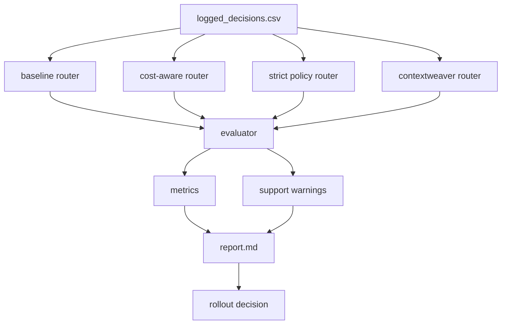

# Architecture

This lab models a support/customer-operations agent with tool-calling behavior. The core flow is:

1. **Logged decisions**: historical-style records with query, intent, available tools, chosen tool, oracle tool, and outcomes.
2. **Candidate policies**: multiple routing strategies (baseline, cost-aware, strict, context-aware).
3. **Offline evaluator**: replays each request with each policy and computes comparable metrics.
4. **Support/coverage checks**: warns when candidate decisions are weakly represented in logs.
5. **Report generation**: emits markdown + terminal summary to inform rollout decisions.

The architecture is local-first and deterministic, so teams can run it in CI before changing production traffic policies.
